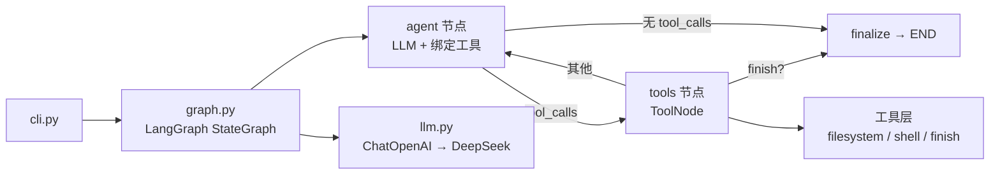

# coding-agent

一个基于 **LangGraph + DeepSeek（OpenAI 兼容接口）** 的独立 CLI coding agent（Python）。

它能：
- **阅读工程**：列出目录树、读取文件、grep / glob 搜索，真正读懂代码而不是靠猜。
- **架构分析**：自动探索工程并输出结构化的架构报告（含 Mermaid 图）。
- **代码修改**：通过精确的字符串替换 / 写文件修改代码，并可调用 Shell 验证构建与测试。

## 架构总览



- **LLM**：`langchain-openai` 的 `ChatOpenAI` 指向 `https://api.deepseek.com/v1`，模型默认 `deepseek-chat`。
- **编排**：`StateGraph` 循环 `agent → tools → agent`，模型调用 `finish` 工具或直接输出答案时结束。
- **上下文管理**：每次调用模型前按字符预算 `trim_messages`，防止长代码库把上下文撑爆。
- **安全**：路径做了 project-root 越界校验；`--read-only` 会移除所有修改类工具。

## 安装

需要 Python 3.10+。

```bash
cd coding-agent
python -m venv .venv
# Windows
.venv\Scripts\activate
# macOS / Linux
source .venv/bin/activate

pip install -r requirements.txt
# 或
pip install -e .
```

配置 API Key（三选一）：

```bash
# 1) 环境变量
export DEEPSEEK_API_KEY=sk-xxx          # PowerShell: $env:DEEPSEEK_API_KEY="sk-xxx"
# 2) 复制 .env.example 为 .env 并填写
copy .env.example .env
# 3) 每次运行时用 --api-key 传入
```

## 使用

```bash
# 1) 架构分析：自动读工程 → 输出报告（可存到文件）
coding-agent --root C:\path\to\project analyze --output report.md

# 2) 一次性任务（可改代码）
coding-agent --root . run "给 utils.py 加一个单元测试"

# 3) 交互式会话
coding-agent --root . chat

# 只读模式（不给写权限 / 不执行 Shell）
coding-agent --root . --read-only analyze
```

用 `python -m coding_agent ...` 也可以（效果等同）。

### 常用参数

| 参数 | 说明 |
|------|------|
| `--root PATH` | 目标工程根目录（默认当前目录） |
| `--model ID` | 模型 id（默认 `deepseek-chat`；V4 Flash 请按你的端点配置） |
| `--api-key KEY` | 覆盖环境变量中的 API key |
| `--read-only` | 只读：禁用 `write_file` / `edit_file` / `delete_file` / `run_shell` |
| `--iterations N` | agent 循环最大步数（默认 40） |

## 工具清单

| 工具 | 用途 | 只读模式下 |
|------|------|-----------|
| `list_directory` | 列出目录树 | ✔ 可用 |
| `read_file` | 按行号读取文件 | ✔ 可用 |
| `grep_search` | 内容正则 / 子串搜索 | ✔ 可用 |
| `file_search` | 按文件名 glob 查找 | ✔ 可用 |
| `write_file` | 整体写入 / 创建文件 | ✘ 禁用 |
| `edit_file` | 精确字符串替换（要求唯一匹配） | ✘ 禁用 |
| `delete_file` | 删除文件 | ✘ 禁用 |
| `run_shell` | 执行 Shell（Windows 用 PowerShell） | ✘ 禁用 |
| `finish` | 标记任务完成并结束循环 | ✔ 可用 |

## 目录结构

```
coding-agent/
├── pyproject.toml / requirements.txt
├── .env.example
└── coding_agent/
    ├── cli.py          # 命令行入口（analyze / run / chat）
    ├── config.py       # 配置（环境变量 + CLI 覆盖）
    ├── state.py        # LangGraph 状态类型
    ├── prompts.py      # 各模式的系统提示词
    ├── llm.py          # ChatOpenAI → DeepSeek 工厂
    ├── graph.py        # StateGraph 编排（agent/tools/finalize）
    └── tools/
        ├── filesystem.py  # 目录/读取/搜索/写入/编辑/删除
        ├── shell.py       # 运行 Shell 命令
        ├── finish.py      # 完成信号
        └── __init__.py    # 工具注册（按 read-only 过滤）
```

## 自定义

- **换模型 / 端点**：改 `.env` 里的 `DEEPSEEK_BASE_URL`、`DEEPSEEK_MODEL`。
- **调整上下文预算**：`Config.context_budget_chars`（默认 180k 字符，近似估计）。
- **加新工具**：在 `tools/` 下写一个 `@tool` 函数，并加入 `tools/__init__.py` 的 `ALL_TOOLS`。

## 已知限制 / 后续方向

- 历史裁剪目前是"丢弃最旧消息"而非 LLM 摘要，超长任务可改用 summarize 节点。
- 编辑是整文件读改写，未做 diff-based 编辑（如 apply_patch），大改时可先跑 `git diff` 审查。
- 没有独立的执行沙箱，`run_shell` 直接在本机运行 —— 高风险场景请配合容器/Docker 使用。
- 尚未接入 VS Code 的 LSP/诊断，若要定位编译错误可让 agent 用 `run_shell` 跑构建命令。
